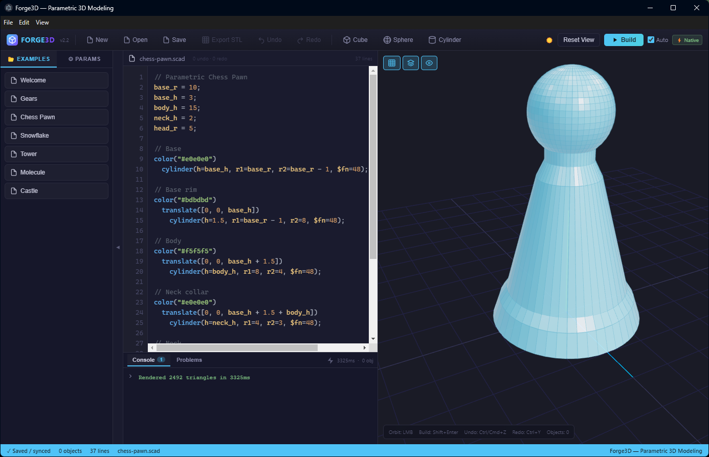

# Forge3D — Parametric 3D Modeling IDE

A modern parametric 3D modeling environment built around OpenSCAD.
Write code → see instant 3D previews → export STL → print.

 



> *Forge3D in Electron mode — chess pawn rendered in 3.3s via native OpenSCAD binary. ⚡ Native badge visible in toolbar.*

---

## Features

| Feature | Browser | Electron |
|---------|---------|---------|
| OpenSCAD WASM renderer | ✅ | ✅ (fallback) |
| **Native OpenSCAD binary render** | ❌ | ✅ **⚡ Full compatibility** |
| `text()` / font support | ⚠️ Limited | ✅ All system fonts |
| Code editor with syntax highlight | ✅ | ✅ |
| **OpenSCAD LSP diagnostics** | ❌ | ✅ Problems tab |
| File open/save | ✅ | ✅ Native dialogs |
| STL export | ✅ | ✅ |
| Drag-and-drop `.scad` files | ✅ | ✅ |
| Dark/light theme | ✅ | ✅ |

---

## Quick Start

### Browser (WASM)

```bash
cd forge3d-app
npm install
npm run dev
# → http://localhost:5173
```

### Electron (Recommended — full OpenSCAD compatibility)

```bash
# Terminal 1 — Vite dev server
npm run dev

# Terminal 2 — Electron
npx electron .
```

**Requirements for Electron mode:**
- [OpenSCAD](https://openscad.org/downloads.html) installed at `C:\Program Files\OpenSCAD\openscad.com`
- The bundled `openscad-lsp.exe` binary is already included at `electron/bin/`

---

## How Rendering Works

```
Browser mode:                     Electron mode:
  WASM sandbox                      Native binary
  (openscad-wasm npm pkg)           (openscad.com)
  ↓                                 ↓
  Limited font support          100% OpenSCAD compat
  Shapes ✅  text() ⚠️          Shapes ✅  text() ✅
```

In Electron, the app automatically detects the native binary and shows the **⚡ Native** badge. No configuration needed.

---

## OpenSCAD LSP (Electron-only)

When running in Electron, the app spawns an `openscad-language-server` process in the background. As you type, it sends your code to the LSP and surfaces diagnostics in the **Problems** tab — syntax errors, unknown variables, etc.

The LSP binary (`openscad-lsp v2.0.1`) is bundled at `electron/bin/openscad-language-server.exe`. It starts automatically and fails silently if not found.

---

## Keyboard Shortcuts

| Key | Action |
|-----|--------|
| `Shift+Enter` / `F5` | Build |
| `Ctrl+S` | Save |
| `Ctrl+O` | Open |
| `Ctrl+N` | New workspace |
| `Ctrl+Z` / `Ctrl+Y` | Undo / Redo |
| Scroll | Zoom |
| Left-drag | Orbit |

---

## Project Structure

```
forge3d-app/
├── electron/
│   ├── main.mjs                    # Electron main: IPC, native render, LSP spawn
│   ├── preload.cjs                 # Context bridge: forgeAPI.* exposed to renderer
│   └── bin/
│       └── openscad-language-server.exe  # Bundled LSP binary (v2.0.1)
├── src/
│   ├── Forge3D.jsx                 # Main UI, state, build orchestration
│   └── forge3d/
│       ├── openscad.worker.js      # WASM render worker
│       ├── lsp-client.js           # LSP JSON-RPC hook (Electron-only)
│       ├── renderer.js             # Three.js viewport
│       ├── editor.jsx              # Code editor
│       ├── stl-parser.js           # Binary + ASCII STL → BufferGeometry
│       └── workspace.js            # File I/O + localStorage persistence
├── public/
│   └── fonts/
│       ├── LiberationSans-Bold.ttf
│       └── LiberationSans-Regular.ttf
├── Samples/
│   └── magnetic_letter_only.scad   # Fridge magnet letter tiles (.scad)
└── docs/
    ├── DEVPLAN.md                  # Active development plan
    ├── WORKFLOW.md                 # UX spec for Design ↔ Print mode
    └── ARCHITECTURE.md             # Technical architecture
```

---

## Available Scripts

| Script | Purpose |
|--------|---------|
| `npm run dev` | Vite dev server (localhost:5173) |
| `npm run dev:host` | Vite dev on 0.0.0.0 (remote dev) |
| `npm run build` | Production web bundle |
| `npm run electron:build` | Electron distributable |

---

## Roadmap

- [x] OpenSCAD WASM renderer
- [x] Native OpenSCAD binary render (Electron)
- [x] OpenSCAD LSP diagnostics (Problems tab)
- [x] Liberation Sans font support
- [x] STL export
- [x] File save/load with native dialogs
- [x] Drag-and-drop `.scad` support
- [x] Dark/light theme
- [ ] Print Mode UI (bed arrangement + PrusaSlicer)
- [ ] PrusaSlicer CLI integration
- [ ] Print bed drag/rotate with multi-part arrangement

---

## License

MIT — use it however you want.
