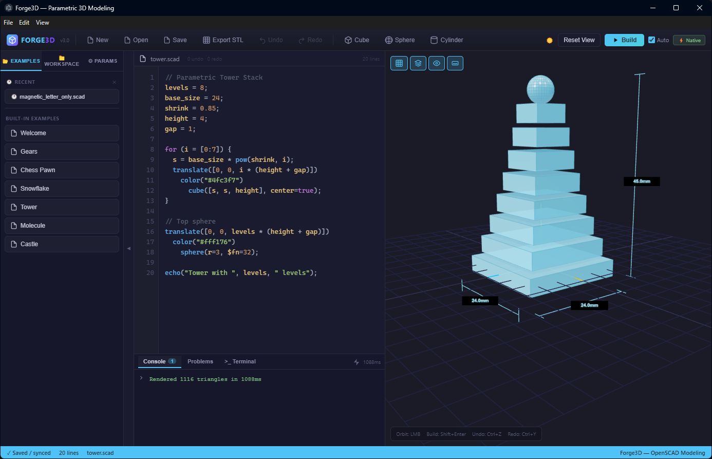

# Forge3D: OpenSCAD modeling IDE

A desktop OpenSCAD IDE built with Electron. Write parametric code, render it with the native OpenSCAD executable, and export STL for your slicer.

  



> Parametric tower rendered through native OpenSCAD with automatic dimension brackets.

---

## What it is

Forge3D runs the OpenSCAD executable installed on your machine and shows the result in a Three.js viewport with orbit controls.

It is a public example of Monroe's desktop product engineering alongside his Android, cloud, and automation work.

Current workflow: write `.scad`, render, export STL, then send the file to your external slicer.

---

## Requirements

- **Windows**, **macOS**, or **Linux**
- **[OpenSCAD](https://openscad.org/downloads.html)** installed locally
- **Node.js 22+** and **npm 10+**

Forge3D looks for OpenSCAD in common platform locations and on `PATH`. Set `FORGE3D_OPENSCAD_BIN` when your OpenSCAD executable lives somewhere custom.
Set `FORGE3D_OPENSCAD_ARCH=x86_64` on macOS if a universal OpenSCAD build exposes an unstable native Apple Silicon renderer and you want Forge3D to force the Rosetta slice.

If OpenSCAD is not installed, Forge3D will show an in-app helper that points to the official OpenSCAD downloads page and community resources.

On Apple Silicon Macs, prefer the current OpenSCAD snapshot because the stable Homebrew cask may be Intel-only:

```bash
brew install --cask openscad@snapshot
```

---

## Install

The [v3.0.2 prerelease](https://github.com/StoneHub/forge3d-app/releases/tag/v3.0.2) has a Windows installer, a Linux AppImage, and an unsigned native Apple Silicon DMG. GitHub Actions built those packages from commit `c5ad9ef` on May 14, 2026. The current source contains changes newer than those artifacts.

> **macOS development preview note:** Forge3D does not currently use a paid Apple Developer ID certificate. Downloaded macOS DMGs are unsigned development previews, so Gatekeeper may report the app as damaged or require manual approval. For the cleanest macOS path, build from source.
>
> **macOS OpenSCAD note:** Homebrew's stable OpenSCAD cask may require Gatekeeper approval and Rosetta because the stable cask can be Intel-based. The snapshot cask includes an Apple Silicon slice and is preferred for local Forge3D development.
> If the snapshot app crashes during render on your Mac, run Forge3D with `FORGE3D_OPENSCAD_ARCH=x86_64` until the upstream native snapshot is stable.

---

## Build from Source

```bash
git clone https://github.com/StoneHub/forge3d-app
cd forge3d-app
npm install

# Dev mode (hot reload)
npm run dev

# Build a package under release/
npm run dist

# Capture deterministic release screenshot
npm run build
npm run capture:release-screenshot
```

> **Build requirements:** Node.js 22, npm 10+, OpenSCAD, Python 3.x with `setuptools` (`pip install setuptools`), and native build tools for `node-pty`.

---

## Features

- **Full OpenSCAD compatibility** — runs your installed binary, supports all fonts, includes, and libraries
- **Live build** — Auto-run mode re-renders on every keystroke (debounced 400ms)
- **Automatic dimension brackets** — CAD-style measurement overlays showing width, depth, and height of rendered objects
- **Smart templates** — categorized OpenSCAD templates with safe append, cursor, and replace workflows
- **Resilient params workflow** — top-level params are detected anywhere in the file, including after appended template blocks
- **OpenSCAD LSP** — bundled `openscad-lsp` binary, diagnostics appear in Problems tab as you type
- **Syntax-highlighted editor** — bracket matching, auto-close, auto-indent, tab-to-spaces
- **Three.js viewport** — orbit (LMB), pan (RMB), zoom (scroll), grid, axes, edge overlay, dimensions
- **Embedded terminal** — PowerShell/bash terminal pane for running commands in workspace folder
- **Workspace helpers** — recent files, workspace browser, and parameter jump-to-source links
- **STL export** — one-click export of the rendered geometry
- **Dark / light theme**

---

## Keyboard Shortcuts

| Key | Action |
|-----|--------|
| `Shift+Enter` / `F5` | Build |
| `Ctrl+S` | Save |
| `Ctrl+O` | Open |
| `Ctrl+N` | New workspace |
| `Ctrl+Z` / `Ctrl+Y` | Undo / Redo |
| `LMB drag` | Orbit |
| `RMB drag` | Pan |
| Scroll | Zoom |

---

## Project Structure

```
forge3d-app/
├── electron/
│   ├── main.mjs                    # IPC: native render, file dialogs, LSP
│   ├── preload.cjs                 # Context bridge
│   └── bin/
│       └── openscad-language-server.exe
├── src/
│   ├── Forge3D.jsx                 # Main UI
│   └── forge3d/
│       ├── assembly.js             # Assembly scene data + transforms
│       ├── assembly-sidebar.jsx    # Assembly workflow controls
│       ├── renderer.js             # Three.js viewport
│       ├── editor.jsx              # Code editor
│       ├── lsp-client.js           # LSP hook
│       ├── params-sidebar.jsx      # Param controls and jump-to-source
│       ├── start-sidebar.jsx       # Start panel with examples/templates
│       ├── stl-parser.js           # Binary + ASCII STL
│       ├── interpreter.js          # Tokenizer (syntax highlight only)
│       ├── terminal.jsx            # Embedded terminal
│       ├── workspace-sidebar.jsx   # Recent files + workspace browser
│       └── workspace.js            # localStorage persistence
├── public/fonts/                   # Liberation Sans TTFs
├── src/forge3d/start-catalog/      # Built-in examples, helpers, and previews
├── scripts/                        # Preview generation and repo utilities
└── docs/
    ├── DEVPLAN.md                  # Active development plan
    └── WORKFLOW.md                 # UX spec
```

---

## Roadmap

- [x] Native OpenSCAD binary render (Electron IPC)
- [x] OpenSCAD LSP diagnostics (Problems tab)
- [x] STL export, file open/save with native dialogs
- [x] Automatic dimension brackets with CAD-style measurements
- [x] Embedded terminal pane (PowerShell/bash)
- [x] Recent files menu + workspace folder browser
- [x] Enhanced Params tab with slider/input UI from `// @param` annotations
- [x] Smart templates with safe append / cursor / replace modes
- [x] Resizable panels — drag handles between editor/viewport and editor/console
- [x] Windows installer (NSIS) via `npm run dist`
- [x] Release screenshot fixture and per-platform capture automation
- [x] GitHub Actions packaging for Windows, macOS, and Linux
- [x] MIT license, public repo
- [ ] Reference parts / assembly layer for loading a second `.scad` beside the active model
- [ ] Print Mode — bed arrangement + PrusaSlicer integration
- [ ] Slicer settings embedded in `.scad` file as comment block
- [ ] AI code generation (plain English → OpenSCAD)
- [ ] Editor upgrades: LSP squiggles, find/replace, multi-cursor

---

## License

MIT © 2026 monro
