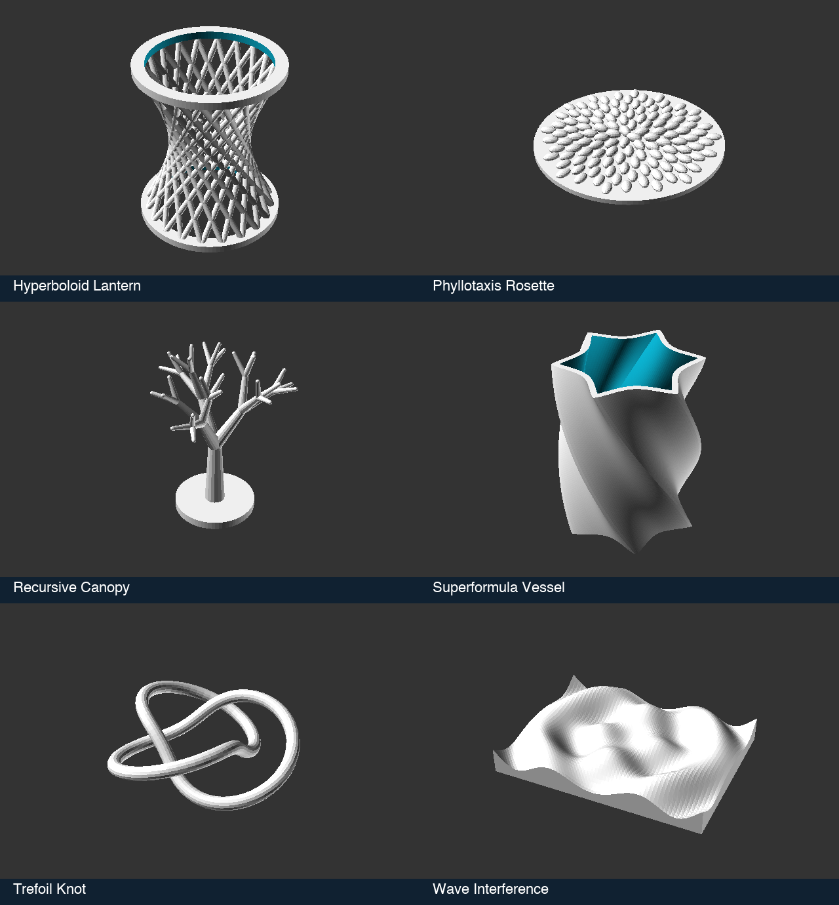

# Math Lab

Open **Start → Math Lab** in a build from current source. Choose **Open Example File**, change a parameter, and build with **Shift+Enter**. Each example is a self-contained OpenSCAD file with its lesson in the source. No library download is needed. These examples are newer than the published v3.0.2 packages.



| Model | Technique | Try this |
| --- | --- | --- |
| [Trefoil Knot](../src/forge3d/start-catalog/scad/math/trefoil_knot.scad) | Parametric space curve, moving frame, wrapped triangle indices | Increase tube radius; follow how tangent, normal, and binormal position each ring. |
| [Superformula Vessel](../src/forge3d/start-catalog/scad/math/superformula_vessel.scad) | Polar function, offset wall, extrusion with twist | Set twist to zero, then change the exponent from 1 to 2. The lobes become a circle. |
| [Phyllotaxis Rosette](../src/forge3d/start-catalog/scad/math/phyllotaxis_rosette.scad) | Golden angle and square-root radial growth | Set angle offset to 6.5 degrees. Near 144 degrees, the seeds line up into spokes. |
| [Recursive Canopy](../src/forge3d/start-catalog/scad/math/recursive_canopy.scad) | Recursion, local coordinate frames, geometric progression | Compare 3, 4, and 5 levels: 13, 40, and 121 branches. |
| [Wave Interference](../src/forge3d/start-catalog/scad/math/wave_interference.scad) | Superposition, sampled height field, closed polyhedron | Set phase to 180 degrees and move the source separation. |
| [Hyperboloid Lantern](../src/forge3d/start-catalog/scad/math/hyperboloid_lantern.scad) | Two families of straight lines on a curved surface | Increase rod twist from 60 to 130 degrees to tighten the waist. |

The comments explain the equations, index layouts, and transformations. Parameter ranges keep the supplied experiments bounded. The knot and tree are sculpture studies that need an orientation/support decision before printing; the lantern is a decorative shell. Native mesh validation does not establish physical printability.

## Verify and regenerate

The regular Node suite checks parameter parsing and editing. To also render all six defaults and both ends of their control ranges with the installed OpenSCAD:

```bash
FORGE3D_TEST_OPENSCAD=1 npm run test:node
```

The native checks require successful warning-free renders, finite coordinates, positive volume, no below-floor vertices, and consistently oriented edges shared by exactly two faces. They check eighteen models in total; they do not exhaust every combination of parameters or detect all possible self-intersections.

Regenerate one thumbnail without rebuilding the whole gallery:

```bash
npm run generate:start-previews -- --only=math-trefoil-knot
```

The `--only` option also accepts comma-separated catalog IDs. All six sources and their native thumbnails are licensed under the repository's MIT license.
